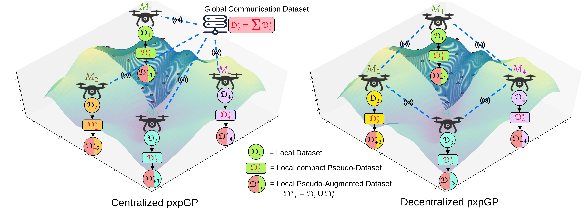

# Proximal Inexact Pseduo Gaussian Processes: (pxpGP)



<!-- **Maintained by:** Sanket A Salunkhe  
**Contact details:** Sanket (sanket_salunkhe@mines.edu), George (george.kontoudis@mines.edu) -->

In this work, we propose the **Proximal Inexact Pseudo Gaussian Process (pxpGP)**, a distributed GP training framework designed for large-scale centralized and decentralized multi-robot networks. Beyond scalability, pxpGP ensures data privacy by exchanging only pseudo-datasets among agents, rather than raw observations.

<!-- -------------------------------------------------------------------------------------- -->

## Python virtual environment setup:

```
python3 -m venv gpenv
source gpenv/bin/activate
pip3 install -r gpenv_requirements.txt
```


<!-- -------------------------------------------------------------------------------------- -->

## Configuration parameters:

All parameters related to GP models training is located inside `config` folder.


<!-- -------------------------------------------------------------------------------------- -->


## Centralized multi-agent GP Training:
### cGP: (Centralized Consensus GP)
Run  cGP using c-ADMM optimization in multi-agent environment:

```
torchrun --nproc_per_node=2 --master_addr=localhost --master_port=12345 cGP_train.py
```
<!-- 
Or
```
python3 -m torch.distributed.launch --nproc_per_node=2 --master_addr=localhost --master_port=12345 cgp_train.py
``` -->

### apxGP: (Centralized Approximate Proximal GP)
Run  cGP using c-ADMM optimization in multi-agent environment:

```
torchrun --nproc_per_node=2 --master_addr=localhost --master_port=12345 apxGP_train.py
```

### gapxGP: (Centralized Generalized Approximate Proximal GP)
Run  cGP using c-ADMM optimization in multi-agent environment:

```
torchrun --nproc_per_node=2 --master_addr=localhost --master_port=12345 gapxGP_train.py
```

### pxpGP: (Centralized Pseudo Approximate Proximal GP) (*Proposed method)
Run  cGP using c-ADMM optimization in multi-agent environment:

```
torchrun --nproc_per_node=2 --master_addr=localhost --master_port=12345 gapxGP_train.py
```

## Decentralized multi-agent GP Training:
### dec_cGP: 

```
torchrun --nproc_per_node=4 --master_addr=127.0.0.1 --master_port=29500 dec_cGP_train.py 
```

### dec_apxGP:

```
torchrun --nproc_per_node=4 --master_addr=127.0.0.1 --master_port=29500 dec_apxGP_train.py 
```

### dec_gapxGP:


### dec_pxpGP:


Where,

1. `nproc_per_node` : No of agent in system
2. `master_addr` :  IP address of central node
3. `master_port` : Port ID of central node


<!-- -------------------------------------------------------------------------------------- -->

## Decentralized multi-agent GP Training :


<!-- -------------------------------------------------------------------------------------- -->

## References :