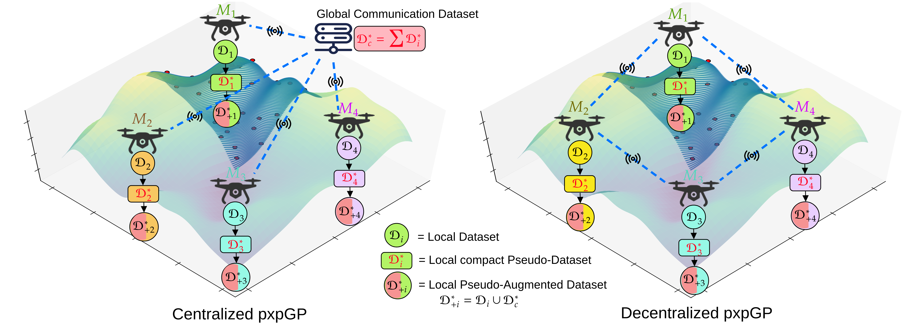

# Proximal Inexact Pseudo Gaussian Process (pxpGP) :



<!-- **Maintained by:** Sanket A Salunkhe  
**Contact details:** Sanket (sanket_salunkhe@mines.edu), George (george.kontoudis@mines.edu) -->

In this work, we propose the **Proximal Inexact Pseudo Gaussian Process (pxpGP)**, a distributed GP training framework designed for large-scale centralized and decentralized multi-robot networks. Beyond scalability, pxpGP ensures data privacy by exchanging only pseudo-datasets among agents, rather than raw observations.

**Contribution**:

1. We extend sparse variational inference technique to generate compact pseudo-datasets, significantly improving the informativeness of shared data and enabling scalability to larger network sizes.

<!-- -------------------------------------------------------------------------------------- -->

## Results:


<!-- -------------------------------------------------------------------------------------- -->

## Experimental Setup:

### Python virtual environment setup:

```
python3 -m venv gpenv
source gpenv/bin/activate
pip3 install -r gpenv_requirements.txt
```

*All parameters related to GP models training is located inside `config` folder. While related datasets are given in `dataset` folder. After successful exection, results will be stored in json file inside `results` folder.*


<!-- -------------------------------------------------------------------------------------- -->


## Centralized multi-agent GP Training:
#### cGP: (Centralized Consensus GP)
```
torchrun --nproc_per_node=2 --master_addr=localhost --master_port=12345 cGP_train.py
```
<!-- 
Or
```
python3 -m torch.distributed.launch --nproc_per_node=2 --master_addr=localhost --master_port=12345 cgp_train.py
``` -->

#### apxGP: (Centralized Approximate Proximal GP)
```
torchrun --nproc_per_node=2 --master_addr=localhost --master_port=12345 apxGP_train.py
```

#### gapxGP: (Centralized Generalized Approximate Proximal GP)
```
torchrun --nproc_per_node=2 --master_addr=localhost --master_port=12345 gapxGP_train.py
```

#### pxpGP: (Centralized Pseudo Approximate Proximal GP) (*Proposed method)
```
torchrun --nproc_per_node=2 --master_addr=localhost --master_port=12345 gapxGP_train.py
```

## Decentralized multi-agent GP Training:
#### dec_cGP: 

```
torchrun --nproc_per_node=4 --master_addr=127.0.0.1 --master_port=29500 dec_cGP_train.py 
```

#### dec_apxGP:

```
torchrun --nproc_per_node=4 --master_addr=127.0.0.1 --master_port=29500 dec_apxGP_train.py 
```

#### dec_gapxGP:
```
torchrun --nproc_per_node=4 --master_addr=127.0.0.1 --master_port=29500 dec_gpxGP_train.py 
```

#### dec_pxpGP:
```
torchrun --nproc_per_node=4 --master_addr=127.0.0.1 --master_port=29500 dec_pxpGP_train.py 
```


Where,

1. `nproc_per_node` : No of agent in system
2. `master_addr` :  IP address of central node
3. `master_port` : Port ID of central node


<!-- -------------------------------------------------------------------------------------- -->

## References :